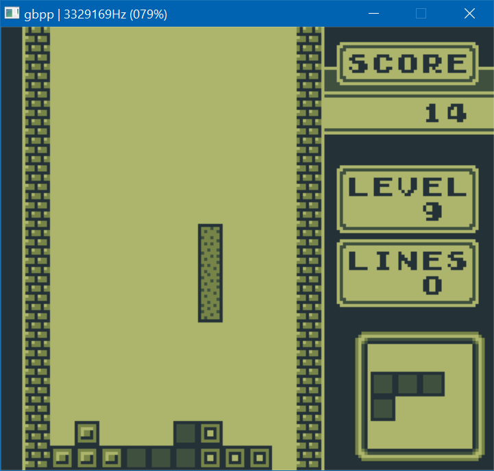
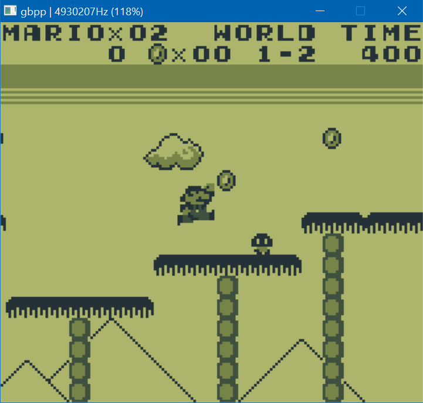

# gbpp (Game Boy Plus Plus)

A DMG Game Boy emulator for Windows written in C++, using SDL2 for the graphics, input and audio.

(Despite its name, it in no way attempts to be better than other emulators out there, it's just a name I came up with.)

## Source code and building

`gbpp.cpp` contains the main application logic and loop, `components/gbcpu.cpp` the CPU (Central Processing Unit) and timer emulation, `components/gbapu.cpp` the APU (Audio Processing Unit) and sound emulation, `components/gbppu.cpp` the PPU (Picture Processing Unit) emulation and `components/gbmem.cpp` the RAM (Random-Access Memory), ROM (Read-Only Memory) and MBC1 (Memory Bank Controller 1) emulation.

Requires `SDL2` to be installed and `SDL2.dll` to be in the same directory as `gbpp.cpp`. It can then be compiled for Windows using MinGW with
```
g++ gbpp.cpp components\*.cpp -I"path/to/includes" -L"path/to/libraries" -lmingw32 -lSDL2main -lSDL2 -o gbpp -O3 -W -Wall -Wno-sign-compare -std=c++11
```

gbpp can (and actually should) be run from the command line, and it accepts flags. Running it with no flags, `-h` or `--help` will print the list of accepted arguments. The message is the following:
```
+-----------------+
|  GBPP emulator  |
+-----------------+
A DMG C++ emulator using SDL2.
By nanohenry

Usage:
gbpp | gbpp -h | gbpp --help            Print this message
gbpp -r [path] | --rom [path]           Load the emulated memory with a ROM from file at [path]
gbpp -s | --no-sound                    Start the emulator muted
gbpp -b [addr] | --breakpoint [addr]    Add breakpoint to [addr]
gbpp -t [path] | --bootrom [path]       Enable the bootstrap ROM and load it from [path]
```

Note that starting without a path to the game ROM will exit immediately with the message
```
ROM name missing! Pass one with the --rom option (i.e. 'gbpp --rom [path/to/rom].gb').
```

## Accuracy

Emulation speed is more or less accurate but some instructions are still incorrectly/not implemented and audio is a bit here-and-there.

It passes some of blargg's instruction test ROMs but the `cpu_instrs` test hangs on test 03. It can run Tetris, Super Mario Land, Is that a demo in your pocket? and some other games or demos (mostly) fine, apart from a few visual artifacts and inaccuraties.

The emulated CPU runs most of the time at around 4MiHz on an Intel Core i7-8550U at 1.80GHz.

## User interface

gbpp's UI consists of two windows, one for the emulated Game Boy's screen and one for debug (which starts hidden but can be shown with **D**). The main window's size is 480x432 pixels, which is three times the resolution of the Game Boy's screen.

In the debug window, gbpp renders the whole background (32x32 8x8 tiles, palette mapped) and the tilemap from addresses `8000h` to `9800h`. It also shows the current value for each register, the last interrupt that was serviced, the current selected ROM bank, the scanline location and a disassembly from addresses `PC - 30` to `PC + 30`.

When exiting the emulator (either by pressing escape or by closing the window) the emulator will dump the five last instructions, the state of the registers as well as the top 10 bytes on the stack.

### Screenshots






*Images from Tetris and Super Mario Land.*

This is the debugger view:


## Controls

The controls are mapped to the following keys:

| Keyboard key(s) | Game Boy button |
| --------------- | --------------- |
| A               | A               |
| S               | B               |
| Arrow keys      | D-pad           |
| Return          | Start           |
| Backspace       | Select          |

In addition to those, there are some other keys that do useful things:

| Keyboard key(s) | Function                                                    |
| --------------- | ----------------------------------------------------------- |
| M               | Put the emulator into step-by-step mode                     |
| Space           | Advance by one instruction if in step-by-step mode          |
| W               | Print a visual representation of the wave channel's samples |
| R               | Reset the emulated CPU                                      |
| D               | Toggle the debugger/disassembler view (hidden by default)   |
| 1, 2, 3 and 4   | Toggle the Game Boy's respective sound channel              |
| Escape          | Exit                                                        |

Right now these keys are hardcoded and cannot be configured (except by manually editing the source code).

## Audio

While the emulator does output sound, it could be more accurate. There are occasional pops and clicks and it does not support noise frequency control or pulse 1's frequency sweep. However, Super Mario Land's and Tetris' soundtracks play mostly fine apart from shorter note durations and ugly noise emulation.

## Things to add in the future

* Fix the CPU, which has some opcodes slightly broken at the moment
* Fix & finish the APU, as the sound sometimes pops and clicks and not everything is supported
* Emulated window support (essentially a second movable background layer)
* Proper background/window/sprite rendering priority support
* More debug options, such as an on-the-fly RAM reader/writer

## Assembler and disassembler

Additionally there are two Python scripts in the repository, one for assembling (`assembler.py`) and one for disassembling (`disassembler.py`). Documentation on those is still TODO.